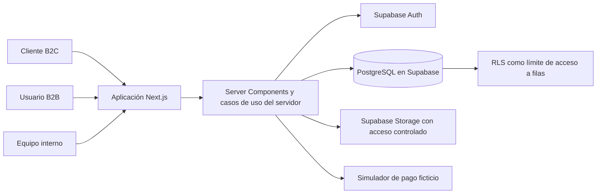

# Arquitectura inicial de NODRIA

**Estado de este documento:** integración local 2026-10-08, código de aplicación hasta `eddd4a0`. Vercel sirve `nodria-staging.vercel.app` y Supabase `ypnhdxpejcbcyjiosrhf` fue creado por el usuario; esta ola no hizo cambios remotos. El reset local incluye 96 productos, 27 categorías y 7 marcas; la migración que agrega catálogo aún no está aplicada al remoto. Auth/correo alojado sigue sin probarse correctamente. Las rutas de blog y guías ya existen en el código local; páginas de marca y campaña siguen pendientes. Ver límites en `STATUS.md` y `WORKSTREAMS.md`.

## Objetivo y restricciones

NODRIA es una empresa tecnológica ficticia para el mercado inicial de España, en español y EUR, con orientación internacional. El producto reúne B2C, B2B y operaciones internas. Debe priorizar un núcleo de funciones conectadas y verificables, evitando que la interfaz prometa workflows inexistentes.

La implementación usa Next.js 16.4, React 19.3, TypeScript 5 y Tailwind CSS 4. Es una aplicación Next.js modular con PostgreSQL/Supabase como destino de persistencia. No se proponen microservicios, colas, cachés o motores de búsqueda externos sin una necesidad medida.

## Vista de contexto



El simulador no es una pasarela externa ni procesa dinero. Checkout autentica en servidor, acepta `variantId`, relee catálogo/stock, valida retries por fingerprint antes de mutar la cesta, persiste por RPC y resuelve el resultado con secreto server-only. La emisión B2B valida tenant/stock y deja el pedido pendiente; owner/admin registra después un anticipo demo idempotente con auditoría, y fulfillment consume reservas solo si está pagado. Procurement conecta recepciones con el ledger. Aprobar una devolución crea reembolso simulado y unidades `pending_inspection`; el almacén puede inspeccionarlas y reponer/desechar con autorización, ledger idempotente y cierre auditado. CSS global usa PostCSS Tailwind; `.module.css` usa el procesamiento nativo de Next/Turbopack.

## Límites de dominio

Los límites son módulos de negocio dentro de la misma aplicación y base relacional; no son servicios desplegados de forma independiente. Los contratos de esquema indicados son conceptuales hasta que las migraciones los definan.

| Dominio | Responsabilidad | Relaciones principales |
|---|---|---|
| Identidad y acceso | Perfil asociado a Auth, direcciones, membresías de organización, roles internos y autorización | Auth, clientes, organizaciones, auditoría |
| Catálogo | Marcas, categorías, productos, variantes y atributos técnicos tipados por categoría | Inventario, precio, búsqueda, contenido |
| Descubrimiento | Búsqueda, filtros, ordenación, comparador y recomendaciones | Catálogo; las consultas deben respetar publicación y disponibilidad |
| Comercio | Carritos, promociones, checkout, intentos de pago demo, pedidos y snapshots históricos | Cliente/organización, catálogo, inventario, envíos, devoluciones |
| Clientes | Perfil, direcciones, wishlist, construcciones guardadas, pedidos y preferencias | Identidad, comercio, soporte, reseñas |
| B2B y CRM | Organizaciones, contactos, leads, oportunidades, actividades, condiciones comerciales y presupuestos | Identidad/membresías, precios, pedidos y auditoría |
| Inventario y compras | Almacenes, cantidades físicas/reservadas, movimientos, proveedores, órdenes de compra y recepciones | Catálogo, pedidos, devoluciones y operaciones |
| Fulfillment y operaciones | Preparación, expedición, seguimiento, incidencias, devoluciones y RMA | Pedidos, inventario, soporte y timeline operacional |
| Soporte y reputación | Tickets, mensajes, devoluciones atendidas, reseñas, votos y moderación | Clientes, organizaciones, pedidos, productos |
| Contenido | Guías, blog, autores y páginas corporativas/legales ficticias | Catálogo y SEO; sin autoridad sobre datos transaccionales |
| Analítica y auditoría | Vistas derivadas de registros operativos y eventos de acciones privilegiadas | Todos los dominios; acceso interno según rol |

### Contratos de datos importantes

- El catálogo distingue producto y variante vendible cuando haya opciones de compra. Los atributos técnicos deben tener un conjunto consultable por tipo de producto; JSON puede guardar extensiones, no reemplazar indiscriminadamente las relaciones importantes.
- `categories.parent_id` expone la jerarquía en el catálogo de lectura; `getCatalogData()` conserva `parentId` y los IDs de todas las categorías por producto. El campo `Product.category` mantiene la categoría raíz para los consumidores existentes. Facetas por descendencia usan memberships explícitas; stock exacto no se expone en catálogo conectado.
- El dataset de profundidad es una migración de datos aditiva e idempotente, no un seed de producción: inserta 84 productos ficticios y conserva los registros preexistentes. El Tech Lead validó su aplicación solo en Supabase local; staging requiere revisión y despliegue manual.
- El pedido conserva snapshots de descripción/SKU, precios, descuentos, impuestos y direcciones usados al confirmarse. Cambios posteriores en catálogo no reescriben el historial.
- La disponibilidad se deriva de `physical - reserved`; reservar y liberar stock debe actualizarse de forma atómica con la transición de pedido correspondiente. No se mantiene una copia derivada sin una regla verificable.
- Los importes se almacenan como `NUMERIC` en PostgreSQL, con moneda explícita en contratos que deban poder extenderse a otros mercados. No se usan cálculos monetarios con coma flotante binaria.
- Carrito, checkout y precio mostrado no son autoridad final: el servidor vuelve a leer precios, descuentos y stock al confirmar.
- Analytics consulta datos transaccionales o vistas derivadas definidas explícitamente; no se rellenan KPIs con porcentajes elegidos a mano.
- Las migraciones son la fuente reproducible del esquema. Seed solo con entidades ficticias, con política clara de entornos.

## Organización lógica prevista

La implementación debe conservar los límites anteriores en una sola aplicación. Como guía, los componentes de interfaz viven cerca de sus rutas; la lógica de casos de uso, validación y acceso a datos se mantiene en módulos de dominio del servidor. Los módulos no deben importar internamente detalles de otro dominio de forma circular: intercambian contratos explícitos o usan el caso de uso propietario.

Los grupos de rutas previstos son superficies públicas (storefront/contenido), autenticadas de cliente, portal B2B e internas. Son una organización conceptual; la estructura final debe seguir los patrones de Next.js 16 y las guías instaladas en `node_modules/next/dist/docs/`. Server Components son el punto de partida; los Client Components quedan para interacciones que necesitan estado o APIs del navegador. Mutaciones críticas se validan y autorizan en servidor mediante la primitiva adecuada de Next.js.

Las landings públicas de `/marcas`, `/campanas` y `/categorias` se calculan desde `getCatalogData()` en Server Components. Las páginas por slug no guardan una segunda copia del catálogo: las marcas agrupan nombres publicados; una categoría incluye la categoría y sus descendientes según `parentId` y memberships; las selecciones agrupan categorías activas y productos asociados. Sitemap y metadatos reutilizan esas identidades; con catálogo no disponible las rutas presentan error cerrado y no sustituyen datos locales.

No se deben duplicar reglas de negocio en componentes cliente, Server Actions, Route Handlers y SQL. La transacción de base de datos debe proteger invariantes concurrentes —por ejemplo, reserva de stock o idempotencia de checkout— cuando una verificación aislada en aplicación no sea suficiente.

## Seguridad prevista y límites actuales

**La migración define controles y tiene gates locales ejecutados; faltan recorrido conectado y cobertura exhaustiva.** El resultado de `tests/integration/postgres-rls.sql` comprueba escenarios seleccionados contra PostgreSQL local; `docs/SECURITY.md` detalla alcance y riesgos restantes.

1. Supabase Auth será responsable de autenticar. La aplicación resolverá el usuario actual en servidor y vinculará su `auth.uid()` a perfiles y membresías persistidas.
2. Los enlaces de confirmación/recuperación vuelven al origen actual del navegador y pasan por `/auth/callback`; la ruta solo acepta destinos internos validados. Supabase aún necesita Site URL/redirect allowlist y un SMTP apto para el entorno alojado.
3. RLS limitará lecturas y mutaciones por propietario o membresía de organización. Las políticas deben cubrir cada tabla expuesta, incluida la separación entre usuarios de una organización y usuarios de otra.
4. Los permisos de personal se comprobarán en servidor y en las políticas apropiadas. No se confiará en roles editables desde el cliente ni en ocultar enlaces como control de acceso.
5. Cada mutación valida datos con esquemas y vuelve a comprobar el acceso al objeto solicitado para evitar IDOR. Los privilegios elevados requieren autorización explícita y registro de auditoría.
6. La clave pública/anon, si se usa desde el navegador, no sustituye RLS. Una clave service-role, si se demuestra necesaria, permanece únicamente en entorno servidor y nunca se envía al cliente.
7. Storage usa rutas y políticas que separen recursos públicos de documentos privados; las descargas privadas requieren autorización o URL firmada de vida corta.
8. El pago demo no recoge ni almacena datos de tarjetas reales. Los estados aprobados, rechazados o temporales son fixtures de simulación y generan un intento y trazabilidad ficticios.
9. No se suben secretos ni datos personales reales al repositorio o a seeds. Preview, desarrollo y producción usan proyectos/credenciales separados.

Las migraciones habilitan RLS/grants, checkout por variante/fingerprint, movimientos y procurement, pedido B2B formal, fulfillment, reembolso e inspección/disposición RMA y reviews. Auth UI/callback/sesión SSR y guards están integrados. El gate local ejercita GoTrue/PostgREST con JWT reales y 78 probes, además de scripts PostgreSQL para RBAC/RLS e inspección RMA. Los `.data/` y fixtures son solo demo local. La matriz CRUD no es exhaustiva y no hay entorno remoto probado; no considerar el producto apto para producción.

## Configuración local y despliegue previsto

### Desarrollo

Requisitos observados: Node.js compatible con Next.js 16 y Corepack/pnpm 10.32.1. Para arrancar el scaffold:

```powershell
corepack enable
pnpm install --frozen-lockfile
pnpm dev
```

El usuario ha creado Supabase staging (`ypnhdxpejcbcyjiosrhf`) y el proyecto Vercel `nodria-staging`; sus secretos no están en el workspace ni se han leído. Los logs compartidos por el usuario reportaron `Invalid supabaseUrl` en runtime. Después mostró valores configurados en Vercel, pero esta ronda no verificó un nuevo request exitoso ni el Auth alojado. `.env.example` documenta `NEXT_PUBLIC_SUPABASE_URL` y `NEXT_PUBLIC_SUPABASE_PUBLISHABLE_KEY`; Supabase local sí está configurado, migrado y probado. El modo demo de archivos solo opera en desarrollo; consulta `lib/server/data-mode.ts` y el estado de fallbacks en `STATUS.md`.

Los nombres públicos configurados son `NEXT_PUBLIC_SUPABASE_URL` y `NEXT_PUBLIC_SUPABASE_PUBLISHABLE_KEY`. Nunca se deben poner valores secretos en variables `NEXT_PUBLIC_*`. No inventar valores ni guardar credenciales reales en Git.

### Entornos de entrega

El entorno alojado actual usa Vercel para Next.js y Supabase para base de datos/Auth. El staging funciona como demo pública y no acepta dinero real. El código de Auth usa callback same-origin; para habilitar confirmaciones/restablecimientos todavía se necesita una allowlist de Auth correcta y un proveedor de correo adecuado. Los RPC/RLS se verificaron en el dashboard por el usuario, pero los nuevos slices de contenido y los datos ampliados no se han aplicado al proyecto remoto. Nunca resetear ni reconstruir la base remota para facilitar desarrollo.

Vercel Preview debe usar datos no productivos y credenciales separadas. Los cambios de schema deben desplegarse en orden controlado antes del código que los consume. El procedimiento concreto de migración y rollback debe seguir las herramientas y migraciones presentes en el repositorio cuando se implemente el workstream de base de datos.

## Verificación y calidad

Los scripts declaran `pnpm lint`, `pnpm build`, `pnpm test` y `pnpm test:e2e`; typecheck usa `pnpm exec tsc --noEmit`. La integración actual tiene 179 Vitest, 18 Node, 17 E2E demo/UX, 4 E2E checkout GoTrue/PostgREST, 5 E2E dominios, un E2E B2B aislado que incluye anticipo aprobado/rechazado, replay y permisos, 230 aserciones pgTAP y 78 probes HTTP Auth, además de SQL runtime de RLS/role/auth/support/inventory/procurement/fulfillment/RMA inspection. Un build o una pantalla renderizada no demuestra integridad funcional ni seguridad.
