# Modelo de datos NODRIA

Snapshot contrastado con las migraciones locales al 2026-10-08. La migración `20261008135808_catalog_depth_dataset.sql` es solo aditiva y fue aplicada en el proyecto Supabase local, no en el remoto. Las migraciones son la fuente de verdad; este mapa resume relaciones y transiciones que importan a la aplicación.

## Relaciones principales

```mermaid
erDiagram
  AUTH_USERS ||--o{ USER_ROLE_GRANTS : recibe
  AUTH_USERS ||--o{ ORGANIZATION_MEMBERSHIPS : pertenece
  ORGANIZATIONS ||--o{ ORGANIZATION_MEMBERSHIPS : agrupa
  AUTH_USERS ||--o{ CARTS : posee
  CARTS ||--|{ CART_ITEMS : contiene
  PRODUCT_VARIANTS ||--o{ CART_ITEMS : selecciona
  AUTH_USERS ||--o{ ORDERS : realiza
  ORGANIZATIONS o|--o{ ORDERS : compra
  ORDERS ||--|{ ORDER_ITEMS : snapshot
  ORDERS ||--o{ PAYMENT_TRANSACTIONS : intenta
  ORDER_ITEMS ||--o{ INVENTORY_RESERVATIONS : reserva
  WAREHOUSES ||--o{ INVENTORY_RESERVATIONS : asigna
  PRODUCT_VARIANTS ||--o{ INVENTORY : almacena
  WAREHOUSES ||--o{ INVENTORY : contiene
  INVENTORY ||--o{ INVENTORY_MOVEMENTS : ledger
  INVENTORY_SUPPLIERS ||--o{ PURCHASE_ORDERS : suministra
  WAREHOUSES ||--o{ PURCHASE_ORDERS : recibe
  PURCHASE_ORDERS ||--|{ PURCHASE_ORDER_LINES : detalla
  PRODUCT_VARIANTS ||--o{ PURCHASE_ORDER_LINES : solicita
  PURCHASE_ORDERS ||--o{ PURCHASE_ORDER_RECEIPTS : recibe
  PURCHASE_ORDER_RECEIPTS ||--|{ PURCHASE_ORDER_RECEIPT_LINES : registra
  PURCHASE_ORDER_LINES ||--o{ PURCHASE_ORDER_RECEIPT_LINES : cumple
  INVENTORY_MOVEMENTS ||--o| PURCHASE_ORDER_RECEIPT_LINES : vincula
  PURCHASE_ORDERS ||--o{ PURCHASE_ORDER_EVENTS : timeline
  ORGANIZATIONS ||--o{ QUOTES : solicita
  QUOTES ||--|{ QUOTE_ITEMS : cotiza
  QUOTES ||--o| BUSINESS_QUOTE_CONVERSIONS : snapshot
  QUOTES ||--o| BUSINESS_QUOTE_ORDERS : emits
  ORDERS ||--o| BUSINESS_QUOTE_ORDERS : links
  ORGANIZATIONS ||--o{ BUSINESS_QUOTE_CONVERSIONS : convierte
  ORGANIZATIONS ||--o{ CRM_ACTIVITIES : historial
  QUOTES o|--o{ CRM_ACTIVITIES : registra
  AUTH_USERS ||--o{ SUPPORT_TICKETS : abre
  ORDERS o|--o{ SUPPORT_TICKETS : contexto
  SUPPORT_TICKETS ||--o{ SUPPORT_MESSAGES : conversa
  SUPPORT_TICKETS ||--o{ SUPPORT_TICKET_EVENTS : timeline
  ORDERS ||--o{ RETURN_REQUESTS : devuelve
  RETURN_REQUESTS ||--|{ RETURN_ITEMS : detalla
  ORDER_ITEMS ||--o{ RETURN_ITEMS : limita
  RETURN_REQUESTS ||--o{ RETURN_REQUEST_EVENTS : timeline
  PRODUCTS ||--o{ PRODUCT_REVIEWS : recibe
  ORDER_ITEMS ||--o| PRODUCT_REVIEWS : verifica
  AUTH_USERS ||--o{ PRODUCT_REVIEWS : escribe
```

## Invariantes operativas

- `orders` conserva la clave idempotente del cliente y un SHA-256 del contenido persistido del carrito y las direcciones. La RPC de checkout bloquea carrito/líneas/stock; una misma clave y payload devuelve el pedido existente, y una carga distinta se rechaza.
- `order_items` conserva SKU, nombres, variante, cantidad, precio, moneda e impuestos del momento de compra. No depende de que el catálogo conserve el mismo producto.
- `inventory` deriva disponible de `on_hand - reserved`. El pedido reserva unidades en la transacción de checkout; pago aprobado conserva la reserva hasta expedición; pago rechazado libera unidades. `inventory_reservations` vincula esas cantidades con líneas de pedido y almacenes.
- `inventory_movements` registra cambios append-only de checkout/fulfillment y recepciones/ajustes. Movimientos manuales guardan actor, motivo/proveedor/albarán, UUID idempotente y fingerprint; actualizan `on_hand`, nunca modifican `reserved`, y bloquean ajuste por debajo de reservas.
- `inventory_suppliers` conserva datos maestros con desactivación lógica. `purchase_orders` copia el nombre del proveedor y las líneas copian SKU, producto, variante, cantidad, coste unitario y EUR para preservar el historial.
- Las órdenes de compra pasan de `draft` a `ordered`, pueden cancelarse antes de finalizar o recibir una o más recepciones hasta `received`. Cada recepción aceptada vincula sus líneas a exactamente un movimiento de inventario; el RPC de recepción actualiza stock, cantidades recibidas, estado y timeline en una transacción.
- La recepción por PO usa UUID idempotente y fingerprint: la misma clave y payload reproduce el resultado, una carga distinta entra en conflicto, y una cantidad o estado no receivable persiste el rechazo sin alterar stock. No se permiten recepciones por encima de la cantidad pendiente.
- `receive_inventory` y `adjust_inventory` rechazan un reintento con clave ya asociada a otro payload. Un mismo payload devuelve el movimiento anterior sin duplicar unidades ni ledger.
- `payment_transactions` pertenece al pedido. `private.demo_payment_attempts` asocia un event ID único a pedido y resultado. El RPC de pago acepta únicamente resultado simulado en el servidor y escribe transición, auditoría/timeline y estado de forma atómica.
- `quotes` y `quote_items` guardan snapshots de organización/contacto, producto, precio solicitado/ofertado, moneda e impuestos. `sales_owner_id` define la propiedad comercial; el equipo comercial puede reclamar solicitudes sin asignar mediante RPC.
- `business_quote_conversions` registra la conversión auditable; `business_quote_orders` enlaza una cotización aceptada con un pedido formal, preservando snapshots comerciales/direcciones e idempotencia. La emisión revalida pertenencia y stock y crea reservas. El pedido nace `pending_payment`; owner/admin del tenant puede registrar anticipo demo por RPC. Solo pagado pasa a fulfillment; rechazado cancela y libera reserva.
- `crm_activities` vincula actividad a lead, solicitud, presupuesto u organización. Las notas `organization` solo son visibles a miembros de la organización antes de que el presupuesto sea reclamado; la cola comercial sin asignar expone actividad `internal`.
- `create_support_ticket` guarda ticket y primer mensaje juntos. `request_return` valida cliente, pedido entregado, ventana y suma acumulada por línea; la clave idempotente impide duplicar una devolución.
- Mensajes/transiciones de agente y review de RMA pasan por RPC idempotente; `support_ticket_events` y `return_request_events` registran timeline sin habilitar DML directo al navegador.
- `product_reviews` exige una línea entregada del autor para ese producto, una review por línea/autor-producto y moderación única desde `pending`. La pública solo expone el estado `published`.
- `categories.parent_id` modela el árbol de navegación. `product_categories` puede enlazar una ficha con su raíz y una o más hojas. La lectura de catálogo conserva `parentId` y `categoryIds`; `Product.category` sigue siendo la raíz para compatibilidad.
- La migración de catálogo agrega 84 productos ficticios, seis nuevas marcas y categorías de detalle sin cambiar filas existentes. El catálogo local contiene 96 productos publicados, 27 categorías, 7 marcas y 96 variantes activas EUR tras reset y seed.
- El payload de checkout usa `variantId`; el pedido mantiene snapshots de variante, SKU y precio. Product IDs legacy solo se aceptan cuando el servidor resuelve exactamente una variante vendible.
- Las membresías usan `owner`, `admin`, `buyer` y `viewer`. La administración se realiza mediante RPCs con validación; la escritura directa a tablas de transición está revocada.
- El catálogo permite lectura conforme a RLS y no expone DML amplio a `authenticated`; la edición de seis campos editoriales pasa por `update_catalog_product_editorial(text,jsonb)`, que valida grants y allowlist en PostgreSQL.

## Migraciones que definen el estado

- `20261007073027_nodria_commerce_foundation.sql` — entidades de catálogo/identidad/comercio, policies y RPC base.
- `20261007085225_database_security_invariants.sql` — grants/RLS y transiciones operativas.
- `20261007094750_support_returns_atomic_intake.sql` — intake atómico y devoluciones idempotentes.
- `20261007094816_crm_b2b_quote_workflow.sql` — presupuestos, snapshots, actividades y membresías B2B.
- `20261007095121_checkout_order_payment_integrity.sql` — fingerprint, dirección, reserva y pagos demo conectados.
- `20261007114945_limit_sales_queue_activity_visibility.sql` — acota notas de actividad visibles a ventas y elimina acceso de ventas a datos de pago.
- `20261007120621_product_reviews.sql` — reviews verificadas, moderación y RLS.
- `20261007120753_support_agent_rma_review_workflow.sql` — timeline y transiciones idempotentes de ticket/agente y revisión de devoluciones.
- `20261007133000_inventory_receipts_idempotent_movements.sql` — recepciones/ajustes autorizados con ledger, proveedor/albarán e idempotencia.
- `20261007134000_crm_business_quote_conversion_audit.sql` — registro de conversión B2B aceptada a snapshots auditables tenant-scoped.
- `20261007140000_checkout_retry_lookup.sql` — lookup autenticado por fingerprint que permite reintentar checkout sin mutar/crear otro carrito.
- `20261007145943_procurement_purchase_orders.sql` — proveedores, órdenes de compra, snapshots de líneas, intentos y líneas de recepción, eventos y RPCs de escritura autorizadas.
- `20261007150000_order_fulfillment_stages.sql` — picking, packing y expedición con transición autorizada, eventos y consumo de reservas.
- `20261007160000_crm_b2b_formal_order.sql` — emisión idempotente de pedidos desde cotización B2B aceptada, snapshots y límites por membresía.
- `20261007180727_rma_approval_refund_inspection.sql` — reembolso demo calculado desde snapshots de pago/precio y estado de inspección pendiente.
- `20261007200000_return_inspection_disposition.sql` — inspección de almacén idempotente; reposición/desecho por línea, ledger y cierre auditado al completar las líneas.
- `20261007210000_b2b_demo_advance_payment.sql` — anticipo B2B demo tenant-scoped; owner/admin, pago/evento/actividad auditados, rechazo que cancela y libera reserva.
- `20261007221456_catalog_editorial_write_contract.sql` — revoca DML amplio a catálogo y expone actualización editorial acotada para roles persistidos `catalog_manager`/`super_admin`.
- `20261008135808_catalog_depth_dataset.sql` — añade datos ficticios de catálogo de forma aditiva; no cambia tablas, grants, políticas ni funciones. Aplicada solo en Supabase local durante la integración.

El esquema ya incluye inspección/disposición de RMA y resolución de anticipo B2B demo con límites por tenant. La configuración remota y las pruebas CRUD exhaustivas de permisos siguen fuera de la verificación local realizada.
