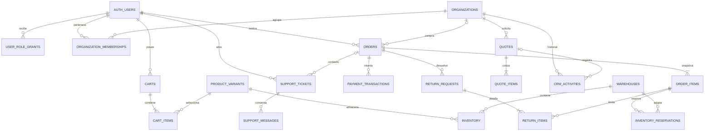

# Modelo de datos NODRIA

Snapshot contrastado con las migraciones locales al 2026-10-07. Las migraciones son la fuente de verdad; este mapa resume relaciones y transiciones que importan a la aplicación.

## Relaciones principales

## Invariantes operativas

- `orders` conserva la clave idempotente del cliente y un SHA-256 del contenido persistido del carrito y las direcciones. La RPC de checkout bloquea carrito/líneas/stock; una misma clave y payload devuelve el pedido existente, y una carga distinta se rechaza.
- `order_items` conserva SKU, nombres, variante, cantidad, precio, moneda e impuestos del momento de compra. No depende de que el catálogo conserve el mismo producto.
- `inventory` deriva disponible de `on_hand - reserved`. El pedido reserva unidades en la transacción de checkout; pago aprobado conserva la reserva hasta expedición; pago rechazado libera unidades. `inventory_reservations` vincula esas cantidades con líneas de pedido y almacenes.
- `payment_transactions` pertenece al pedido. `private.demo_payment_attempts` asocia un event ID único a pedido y resultado. El RPC de pago acepta únicamente resultado simulado en el servidor y escribe transición, auditoría/timeline y estado de forma atómica.
- `quotes` y `quote_items` guardan snapshots de organización/contacto, producto, precio solicitado/ofertado, moneda e impuestos. `sales_owner_id` define la propiedad comercial; el equipo comercial puede reclamar solicitudes sin asignar mediante RPC.
- `crm_activities` vincula actividad a lead, solicitud, presupuesto u organización. Las notas `organization` solo son visibles a miembros de la organización antes de que el presupuesto sea reclamado; la cola comercial sin asignar expone actividad `internal`.
- `create_support_ticket` guarda ticket y primer mensaje juntos. `request_return` valida cliente, pedido entregado, ventana y suma acumulada por línea; la clave idempotente impide duplicar una devolución.
- Las membresías usan `owner`, `admin`, `buyer` y `viewer`. La administración se realiza mediante RPCs con validación; la escritura directa a tablas de transición está revocada.

## Migraciones que definen el estado

- `20261007073027_nodria_commerce_foundation.sql` — entidades de catálogo/identidad/comercio, policies y RPC base.
- `20261007085225_database_security_invariants.sql` — grants/RLS y transiciones operativas.
- `20261007094750_support_returns_atomic_intake.sql` — intake atómico y devoluciones idempotentes.
- `20261007094816_crm_b2b_quote_workflow.sql` — presupuestos, snapshots, actividades y membresías B2B.
- `20261007095121_checkout_order_payment_integrity.sql` — fingerprint, dirección, reserva y pagos demo conectados.
- `20261007114945_limit_sales_queue_activity_visibility.sql` — acota notas de actividad visibles a ventas y elimina acceso de ventas a datos de pago.

El esquema no convierte por sí solo pantallas todavía demo (Operations Center, compras, analítica o PC Builder) en flujos conectados.
